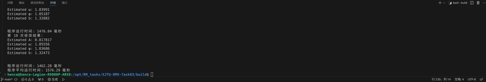
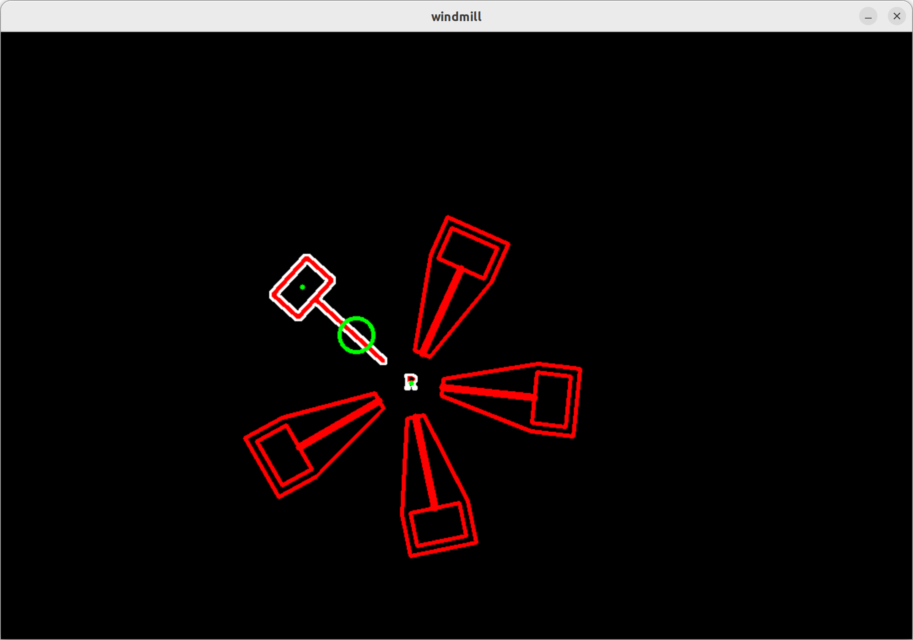

# XJTU-RMV-Task03

# 能量机关识别与预测 

看到对于角速度的函数进行拟合，首先想到的是最小二乘法，梯度下降等一些我已知的拟合算法。但是最小二乘好像不太适合这个函数的拟合，梯度下降尝试了，但是效果不是特别好（也可能是因为当时的一些其他错误没有改过来导致的，打算后面再试试）。后面通过GPT得知还有一个神奇的Ceres库。于是开始利用Ceres库来尝试拟合函数。

## 一、遇到的一些错误与改进

1. 通过面积范围识别 R 和扇叶，虽然在绝大多数帧上可以实现对于目标的识别，但是存在部分帧识别失败的情况，导致收集到的数据不连续，影响函数拟合。

2. 时间t除不除1000的问题，后面cout时间t发现值太大了，于是/1000改了过来。（后面组长在群里面发了windmill.hpp文件后，我就把在main.cpp文件里面对时间的处理放到windmill.hpp文件里面处理了）

3. 数据的平滑处理，起初直接用得到的数据来进行拟合，效果不好，经常遇到不收敛的情况，打印发现收集到的angles比较毛糙，通过平滑处理后拟合好多。

   更新：今天发现这个针对角速度进行拟合确实效果变好，但是对于角度函数，去掉平滑处理后反而效果更好。个人觉得是因为收集到的angles是第一手未经任何处理过的数据，所以直接用angles数据进行拟合会更好，速度也更快，用了都说好。

4. 能量机关旋转的时候，有可能会移动到窗口外，导致识别错误，进而导致程序终止报错。比如：段错误 (核心已转储)、浮点异常 (核心已转储)。后面我是通过把windmil.cpp文件里面的初始center值范围调整了一点解决该问题。

5. 直接对角速度进行拟合，感觉数据不是特别准确。实际结果也是收敛花费时间长，且收敛的结果不是很好。于是考虑对角速度函数进行积分，得到angle关于t的函数，这样收集到的angle和t都是直接的未处理过的数据（不考虑平滑的话）。验证结果是收敛速度明显优于对角速度函数的拟合。

6. 目前还未解决的问题：
   - 在重复进行函数拟合的过程中，在相同的初始值下，有时候会收敛到其他值，甚至不收敛。Ceres优化器的内在逻辑还未了解，所以不明白其原因。（猜测可能是陷入了局部最优解？）目前我通过收敛超时判断，来中断异常的收敛，重新进行收敛。当然，我在重复的过程中保留了失败收敛的时间。

     更新：去掉平滑后，收敛超时报错的概率变得更小了，猜想还是上面第三点说明的原因。

   - 发现对于A，omega和b都能快而较为精确地收敛到预期的参数值，但是对于fai每次都会收敛到比预期值1.81小零点几的值（1.77）。目前还未发现问题到底出在哪里，但是符合5%的误差要求，先用着。

## 二、运行结果

1. 平均拟合收敛时间（包括失败收敛的时间）

   

2. 识别 R 标以及锤子，绘制两个中心点以及circle

   